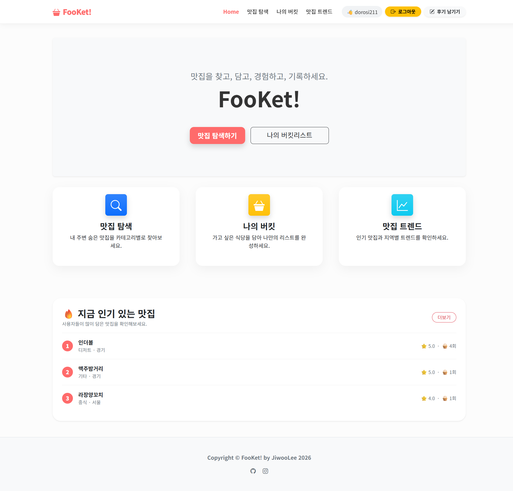
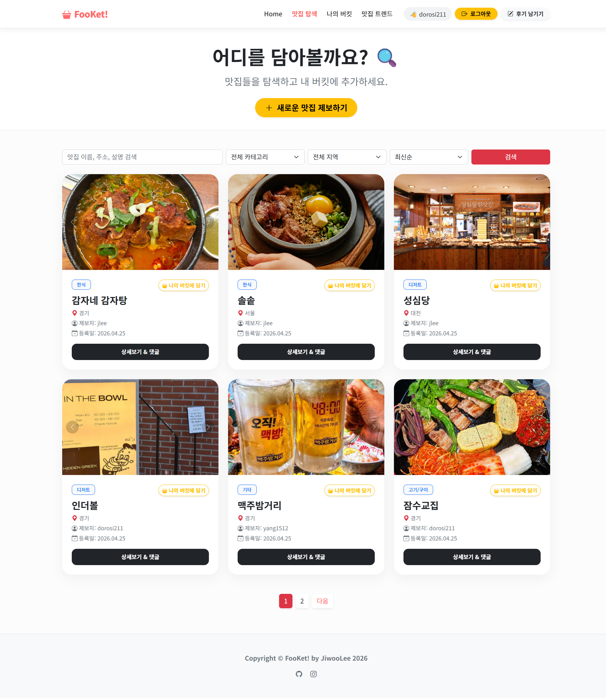
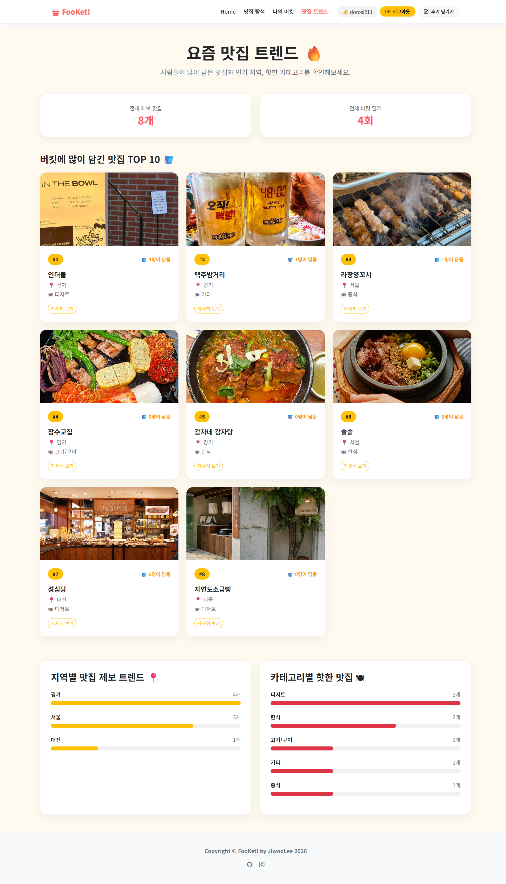

# 📍 나만의 맛집 기록 서비스 FooKet! (MatzipProject)

**FooKet!**은 **Food**와 **Bucket List**를 결합한 이름으로,  
가고 싶은 맛집을 버킷리스트처럼 담고 방문 후 기록할 수 있다는 의미를 담았습니다.

이 프로젝트는 맛집을 찾고, 담고, 경험하고, 기록할 수 있는 웹 서비스입니다.  
🦁 멋쟁이사자처럼 14기 백엔드 과제 실습의 일환으로 제작되었습니다.

### Live Demo

🔗 웹사이트 바로가기: [FooKet 바로가기](https://jiwoolee0211.pythonanywhere.com/)

---

### Preview

#### Main Page

#### Restaurant List Page

#### Trend Page

---

### 주요 내용

* 맛집 리스트 조회 및 등록
* 지역 및 카테고리별 맛집 분류
* 맛집 상세 정보 확인
* 댓글 및 리뷰 작성
* 별점 기반 맛집 평가
* 버킷리스트에 가고 싶은 맛집 저장
* 버킷 메모 작성 및 수정
* 로그인 / 회원가입 기능
* Google 및 Kakao 소셜 로그인
* 맛집 트렌드 확인

---

### Tech Stack

* Python (Django)
* SQLite
* HTML / CSS (Bootstrap)
* JavaScript
* Django Authentication
* Django Allauth
* Git / GitHub

---

### Project Structure

* **Main**: 서비스 메인 페이지 및 소개
* **Restaurants**: 맛집 목록, 등록, 상세 조회 및 카테고리/지역 분류
* **Reviews**: 방문 후기 및 평점 시스템
* **Buckets**: 가고 싶은 맛집 저장 및 개인 메모 관리
* **Accounts**: 로그인, 회원가입 및 소셜 로그인 기능
* **Static**: 정적 파일(CSS, JS, Images) 관리
* **Templates**: 공통 레이아웃 및 페이지별 화면 구성